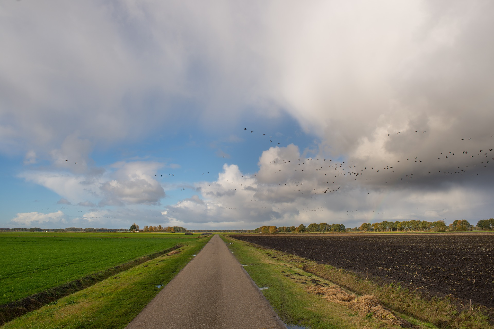
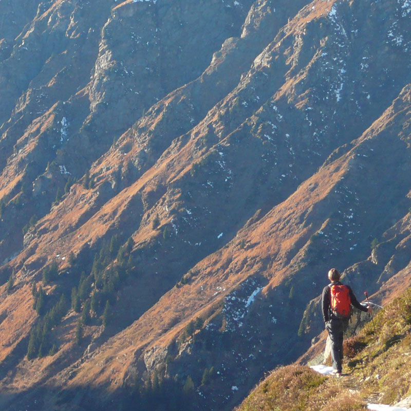
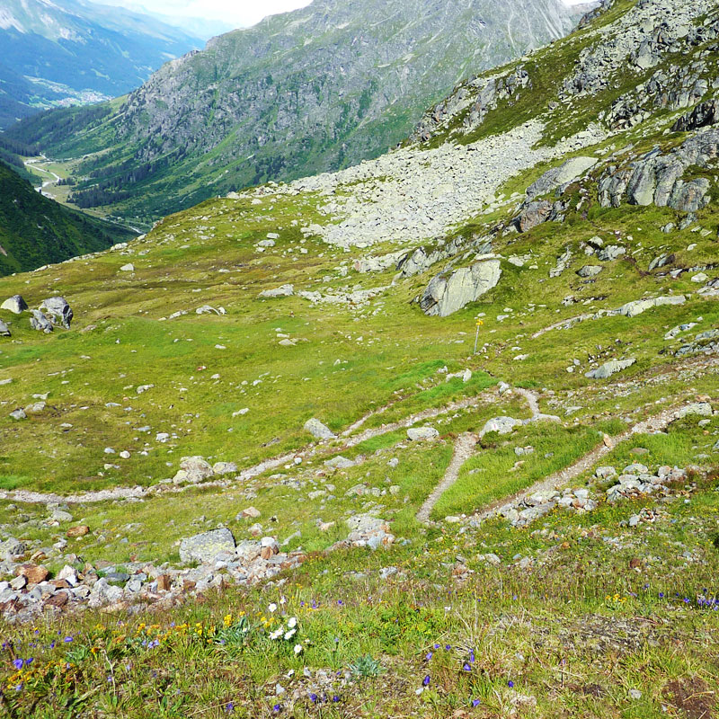
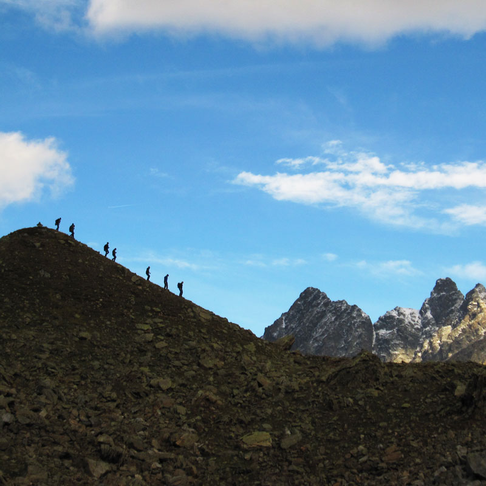
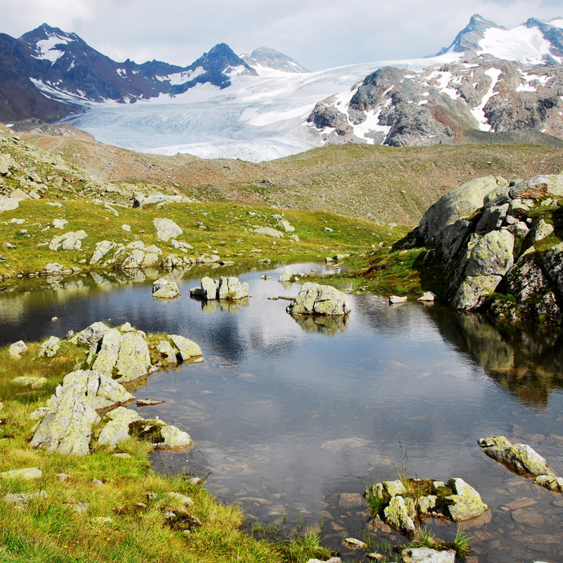
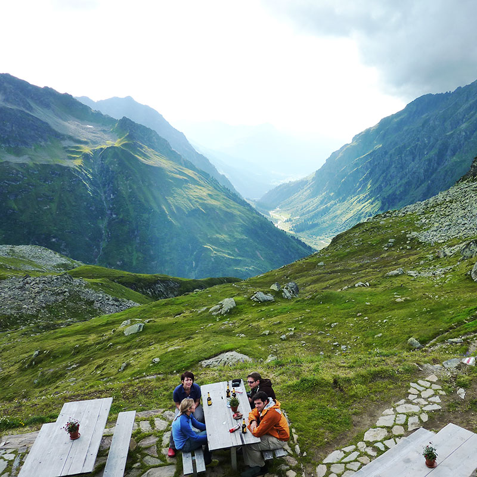
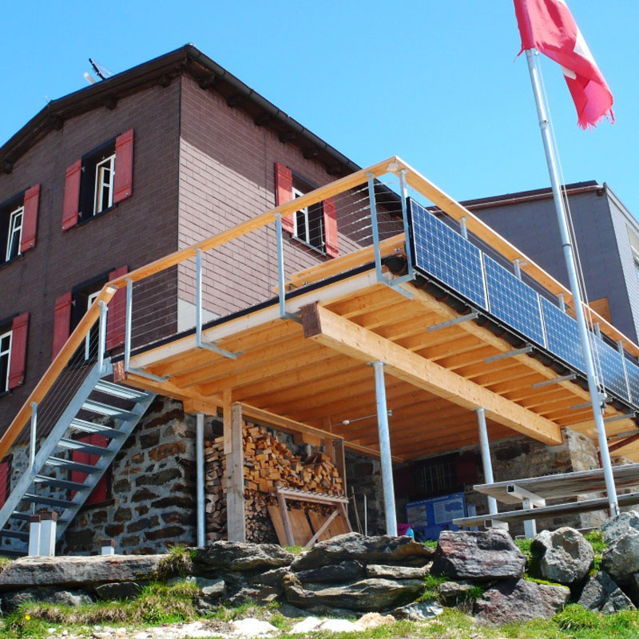

<!-- .slide: data-background="img/bg-main.png" -->

## 3D with [#esrijs](https://developers.arcgis.com/javascript/)
###  EU DevSummit 2017 - Speedgeeking

<br>

<small>
Javier Gutierrez | [javier_gutierrez@esri.com](mailto:javier_gutierrez@esri.com) | [@jgutierrez0](https://twitter.com/jgutierrez0)
<br>
ESRI R&amp;D Center Zürich
</small>

---

## let's go hiking?

---




---

## not bad, but a bit 2D-ish..

---

## how about some mountains?

---




---





---




https://www.silvrettahuette.ch

---

### Hike to Silvretta hut, in the Swiss Alps


<div class="twos">
  <div class="snippet">
    <pre>
      <code class="lang-js hljs javascript">
var map = new WebMap({
  portalItem:{
    id: "d721eb35a09747e4a1aa8bcd491d9ecc"
  }
});

view = new MapView({
  map: map,
  container: "viewDiv"
});
      </code>
   </pre>
  </div>

  <div class="snippet-preview">
    <iframe id="frame-auto-cast" data-src="./snippets/hike-map.html"></iframe>
  </div>
</div>

---

### Hike to Silvretta hut, in the Swiss Alps, with a Legend :)


<div class="twos">
  <div class="snippet">
    <pre>
      <code class="lang-js hljs javascript">
var map = new WebMap({
  portalItem:{
    id: "d721eb35a09747e4a1aa8bcd491d9ecc"
  }
});

view = new MapView({
  map: map,
  container: "viewDiv"
});

var legend = new Legend({ view: view });
view.ui.add(legend);
      </code>
   </pre>
  </div>

  <div class="snippet-preview">
    <iframe id="frame-auto-cast" data-src="./snippets/hike-map-legend.html"></iframe>
  </div>
</div>


---


---

<!-- .slide: data-background="images/Picture2.png" -->

## More API: Presentation

- slide contains: viewpoint, layer visibility, basemap, environment + metadata

```
webscene.presentation = {
  slides : []
}

// capture current scene state
var slide = Slide.createFrom(view);

// re-apply the stored state
slide.applyTo(view);

```

---

<!-- .slide: data-background="images/Picture2.png" -->

## More API: Clipping

- clipping is only supported for local scenes
```
scene = new WebScene({
    viewingMode: 'local',
    clippingArea: {
      xmin: 344556.17949990794,
      ymin: 3786680.957522931,
      xmax: 368905.9689491527,
      ymax: 3801033.594521225,
      spatialReference: { wkid: 26711 }
    },
    clippingEnabled: true
});
```
---

<!-- .slide: data-background="images/Picture2.png" -->
## More API: External Rendering
<table  class="reveal">
    <tr>
      <td></td>
      <td><a href="http://developers.arcgis.com/javascript/latest/sample-code/scene-external-renderer/live/index.html"></a></td>
    </tr>
  </table>


